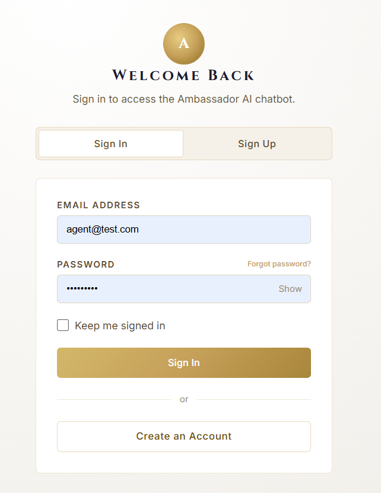
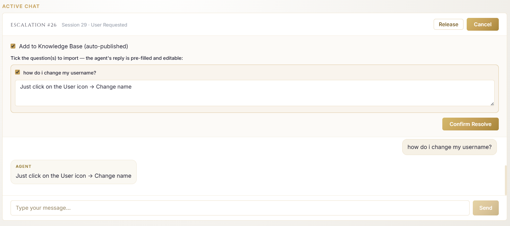
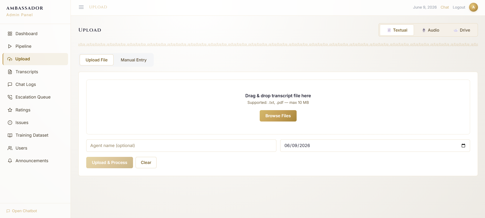
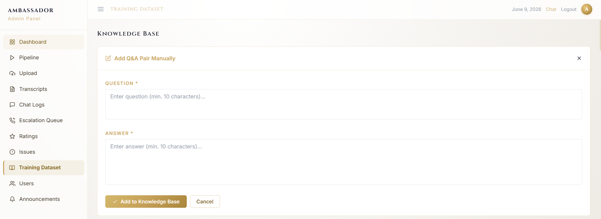
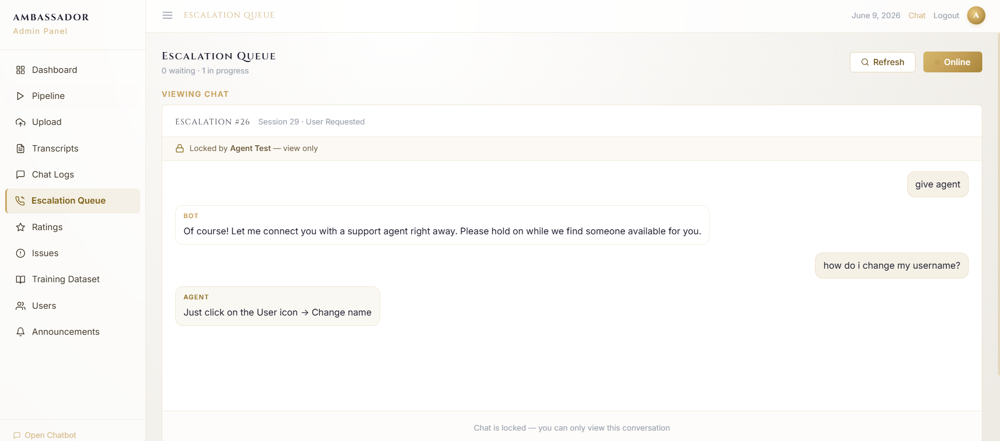

# User Manual / Korisnički priručnik

Ovaj priručnik je pisan za **krajnjeg korisnika sistema**, ne za programera. Objašnjava kome je sistem
namijenjen, kako se prijaviti, koje uloge postoje i kako korak-po-korak obaviti najvažnije zadatke.

> **Live aplikacija:** <https://purple-field-0d55d8003.7.azurestaticapps.net/>

---

## 1. Kome je sistem namijenjen

**Call Centar Chatbot** je AI asistent za podršku call centru telekom/ISP operatera. Pomaže da se brzo
dođe do tačnih odgovora na pitanja o internetu, TV-u, mobilnim uslugama, naplati i tehničkoj podršci.
Sistem koriste tri vrste korisnika:

- **Korisnik (user)** — postavlja pitanja chatbotu i, kad treba, biva spojen s živim agentom.
- **Agent** — preuzima eskalirane razgovore, pretražuje bazu znanja i vodi živi chat s korisnikom.
- **Administrator (admin)** — upravlja transkriptima, bazom znanja, korisnicima, ocjenama i obavijestima.

(Postoji i uloga **manager** sa pravima nivoa administracije nad pregledima; u praksi se admin koristi
za sve administrativne radnje.)

---

## 2. Korisničke uloge i šta svaka može

| Uloga | Pristup | Glavne mogućnosti |
|---|---|---|
| `user` | `/chat`, `/home` | chat s botom, ocjena odgovora, historija razgovora, eskalacija na agenta, postavke naloga |
| `agent` | `/agent` (+ chat) | live queue eskalacija, vođenje razgovora s korisnikom, pretraga baze znanja, vlastita historija |
| `admin` | `/admin` (+ sve) | transkripti, baza znanja, korisnici, chat logovi, ocjene, issues, obavijesti, scheduled import |
| `manager` | pregledi nivoa admina | pregled i kontrola podataka |

---

## 3. Kako se korisnik prijavljuje

1. Otvori aplikaciju: <https://purple-field-0d55d8003.7.azurestaticapps.net/> i otiđi na login ekran (`/login`). Prikazuje se kartica **Welcome Back** s porukom „Sign in to access the Ambassador AI chatbot".
2. Provjeri da je odabran tab **Sign In** (lijevi tab; desni tab **Sign Up** služi za registraciju).
3. U polje **Email Address** unesi email, a u polje **Password** lozinku (možeš kliknuti **Show** da provjeriš unos).
4. Po želji označi **Keep me signed in** da ostaneš prijavljen, a ako si zaboravio lozinku klikni **Forgot password?**.
5. Klikni dugme **Sign In**.
6. Nakon prijave sistem te vodi na ekran prema tvojoj ulozi (korisnik → chat/home, agent → agent panel, admin → admin panel).
7. Novi korisnik se registruje klikom na **Create an Account** (ili tab **Sign Up**); default uloga je `user`, a ulogu kasnije mijenja administrator.

**Odjava:** preko korisničkog menija (UserMenu) u gornjem desnom uglu → **Logout**.

*Slika 1: Prijava — kartica „Welcome Back" s tabovima Sign In / Sign Up, poljima Email Address i Password (opcija Show), opcijom Keep me signed in i dugmadima Sign In i Create an Account.*

---

## 4. Testni korisnici (demo kredencijali)

| Uloga | Email | Lozinka |
|---|---|---|
| Administrator | `admin@test.com` | `admin123` |
| Agent | `agent@test.com` | `Agent1234` |
| Korisnik | `user@test.com` | `User1234` |

---

## 5. Opis glavnih ekrana

| Ekran | Putanja | Sadržaj |
|---|---|---|
| Landing | `/` | Uvodna stranica s opisom i prijavom |
| Login | `/login` | Prijava i registracija |
| Chat | `/chat` | Razgovor s AI asistentom, ocjena, eskalacija |
| Home | `/home` | Početni pregled za prijavljenog korisnika |
| Admin panel | `/admin` | Bočni meni (Ambassador · Admin Panel): Dashboard, Pipeline, Upload, Transcripts, Chat Logs, Escalation Queue, Ratings, Issues, Training Dataset, Users, Announcements; dno: Open Chatbot |
| Agent panel | `/agent` | Bočni meni (Ambassador · Agent Console): Dashboard, Live Queue, Knowledge Base, My History; u headeru prekidač **Online/Offline** |

> Na vrhu admin ekrana je naziv aktivne sekcije i, u gornjem desnom uglu, datum, **Chat** i **Logout**. Ikona s tri crte (☰) u gornjem lijevom uglu otvara/zatvara (toggle) lijevi bočni meni — radi isto i u **Admin Panel-u** i u **Agent Console-u**.

---

## 6. Korak-po-korak: najvažniji korisnički tokovi

### 6.1 Korisnik — postavljanje pitanja chatbotu
1. Prijavi se kao `user` i otvori **Chat** (`/chat`).
2. U polje **Please type your inquiry…** upiši pitanje (npr. „How do I reset router?").
   - **Odabir jezika:** pored polja je padajući birač jezika (npr. **BS**) kojim biraš jezik razgovora.
   - **Diktiranje (glasovni unos):** klikom na ikonu mikrofona (🎤) pitanje se može unijeti glasovnim putem umjesto tekstualnim unosom.
   - Poruku šalješ dugmetom za slanje (ikona aviončića ➤).
   - Ispod polja stoji napomena: „Ambassador may occasionally produce errors. Verify critical information independently."
3. **Očekivani rezultat:** asistent vraća odgovor zasnovan na bazi znanja. Ako je pouzdanost niska, odgovoru se dodaje napomena o nesigurnosti.
4. Ako sistem nema dovoljno siguran odgovor **ili** zatražiš agenta („i want to talk to an agent"), pokreće se **eskalacija** — pri vrhu chata dobiješ baner s pozicijom u redu (npr. „You're #1 in queue — an agent will be with you shortly") i dugme **Cancel** za odustajanje od čekanja. (U headeru chata su i **Home** i **End chat**.)

### 6.2 Korisnik — ocjena odgovora
1. Nakon odgovora možeš ostaviti ocjenu (1–5) — na kraju razgovora prikazuje se forma za ocjenu sesije.
2. Možeš dodati komentar i, ako je odgovor netačan, označiti ga kao netačan.
3. **Očekivani rezultat:** ocjena je sačuvana; negativan feedback ili „netačan odgovor" se evidentira kao Issue koji admin može pregledati.

### 6.3 Korisnik — historija razgovora i postavke
1. Pristup **Chat history** ostvaruje se klikom na ikonu u gornjem lijevom čošku.
2. Možeš obrisati pojedinačni razgovor **desnim klikom** na odabrani chat u  **Chat history**.
3. Klikom na **User settings** ikonu gornjem desnom čošku možeš promijeniti ime klikom na **Change name** , obrisati čitavu historiju klikom na  **Delete all history**, obrisati vlastiti account klikom na **Delete account** ili se odjaviti sa profila klikom na **Logout**.

### 6.4 Agent — preuzimanje eskalacije i live chat
Agent radi u **Agent Console** (`/agent`) s bočnim menijem: **Dashboard, Live Queue, Knowledge Base, My History**. U headeru su datum, link **Chat**, prekidač statusa **Online/Offline**, zvonce za notifikacije i **Logout**.

1. Prijavi se kao `agent` i otvori **Agent panel** (`/agent`).
2. **Dashboard** daje pregled rada: kartice **Handled Today** (riješene eskalacije danas), **This Week** (zadnjih 7 dana), **Avg Response** (prosječno vrijeme odgovora, zadnjih 30 dana) i **Queue Now** (koliko ih čeka agenta), te **Currently Handling** (trenutni chat ili „No active chat right now." s dugmetom **View Queue**) i **Recent Activity**.
3. Da bi primao razgovore, prebaci status na **Online** (iz **Offline**) — dok si offline ne stižu novi chatovi. Dugme **Go Online** (npr. na ekranu Live Queue) radi potpuno isto kao prekidač **Online/Offline** u navbaru u gornjem desnom uglu — oba mijenjaju isti status.
   - **Zvučna notifikacija eskalacije:** kada je agent/admin **Online**, zvuk koji javlja da neko čeka u redu čuje se **bilo gdje u sistemu** (na kojoj god stranici da se nalazi). Kada je **Offline**, zvuk se čuje **samo dok je otvorena stranica Escalation Queue** (Live Queue).
   - **Postavke notifikacija (zvonce 🔔 u headeru):** klikom na zvonce otvara se meni **Notifications** s dvije opcije: **Sound on new escalation** (zvučni signal kad stigne nova eskalacija) i **Browser notifications** (obavijesti samog browsera). Svaku uključuješ/isključuješ njenom kvačicom.
4. Otvori **Live Queue** (prikazuje „X waiting · Y in progress"). Dugme **Refresh** osvježava listu; eskalirani upiti su pod **Waiting Queue** (kad je prazno: „No pending escalations. Go online to receive new chats."). Svaki upit prikazuje broj (npr. **#25**), prioritet (npr. **High**), izvor (npr. **User Requested**), status (npr. **Pending**), tekst upita i koliko je star (npr. „1m ago").
5. Klikni **Accept** na upitu → otvara se **Active Chat** (zaglavlje npr. „Escalation #25 · Session 28 · User Requested"). Razgovaraš s korisnikom u realnom vremenu (WebSocket): poruku unosiš u polje **Type your message…** i šalješ dugmetom **Send**.
   - **Release** — vrati eskalaciju nazad u red (oslobodi je za drugog agenta) bez rješavanja.
6. Po potrebi otvori **Knowledge Base** i u polje **Search questions or answers… (min. 2 chars)** upiši pojam pa klikni **Search** da nađeš odobreni odgovor koji pomaže tokom chata.
7. Kad je problem riješen, klikni **Resolve** — to zatvara eskalaciju (sesija se označava kao riješena, agent se oslobađa, a korisnik se obavještava). Prije zatvaranja otvara se panel za import Q&A parova:
   - **Add to Knowledge Base (auto-published)** (checkbox) — ako je uključeno, odabrani Q&A parovi iz razgovora idu direktno u bazu znanja.
   - „Tick the question(s) to import — the agent's reply is pre-filled and editable" — označi pitanja koja želiš importovati (agentov odgovor je već popunjen i može se urediti; ako nema ničega: „No answered customer questions to import yet.").
   - Klikni **Confirm Resolve** da zatvoriš eskalaciju (dugme je aktivno tek kad je označeno bar jedno pitanje, ako importuješ), ili **Cancel** da se vratiš na razgovor.

   
   *Slika 2: Rješavanje eskalacije — opcija „Add to Knowledge Base (auto-published)", označeno pitanje s pre-popunjenim (i izmjenjivim) agentovim odgovorom i dugme Confirm Resolve.*
8. Riješene/zatvorene eskalacije vidiš u **My History** (kad je prazno: „No resolved escalations yet.").
9. **Očekivani rezultat:** sesija je riješena, agent oslobođen, korisnik obaviješten ako je napustio razgovor.

### 6.5 Administrator — upload i obrada transkripta
1. Prijavi se kao `admin` i otvori **Admin panel** → **Upload**. U gornjem desnom čošku biraš način unosa: **Textual**, **Audio** ili **Drive**.

**A) Tekstualni transkript — tab `Textual`** (format `Agent:` / `Korisnik:`)
   - Za upload fajla u `.txt` ili `.pdf` formatu klik na **Upload file** (default).
   - Za ručni unos teksta klik na **Manual Entry**.
   - Opciono: unesi ime agenta koji je odgovarao na pitanja u transkriptu i datum vezan za transkript.
   - Klik na **Upload & Process** pokreće obradu.

*Slika 3: Upload transkripta — tab Textual s opcijama Upload File / Manual Entry, „Drag & drop" zonom (.txt, .pdf, max 10 MB), poljem Agent name (optional), datumom i dugmadima Upload & Process / Clear.*

**B) Audio transkript — tab `Audio`**
   - Uploaduj audio fajl.
   - Klikom na **Language** odaberi jezik audia: **English (EN)**, **Bosnian (BS)**, **German (DE)** ili **Auto / detect language** (sistem sam prepoznaje jezik).
   - Klik na **Start transcription** pokreće transkripciju i obradu.

**C) Google Drive link — tab `Drive`**
   - Kopiraj URL defaultnog foldera na Google Drive-u koji je podešen administratoru i unesi ga u predviđeno polje.
   - Opciono: kreiraj foldere unutar defaultnog foldera i kopiraj URL unutrašnjeg foldera.
   - Kao i kod audija, klikom na **Language** odaberi jezik (**English (EN)**, **Bosnian**, **German** ili **Auto / detect language**).
   - Klik na **Start import** pokreće preuzimanje i obradu.

2. Bez obzira na način unosa, transkript prolazi kroz pipeline: normalizacija → maskiranje PII → detekcija govornika → chunking → ekstrakcija Q&A → embedding → upis u bazu znanja.
3. **Očekivani rezultat:** u **Pipeline Monitor** pratiš napredak po fazama u realnom vremenu; po završetku Q&A parovi čekaju odobrenje.
   *(Primjer: kao administrator, da bih odobrio prijedlog, otvorim Knowledge → Pending, pregledam par i kliknem Approve; sistem prikaže status i par uđe u bazu znanja.)*

### 6.6 Administrator — kuriranje baze znanja (Training Dataset)
1. **Admin panel → Training Dataset** (ekran ima naslov **Knowledge Base**).
2. Na vrhu su brojači stanja baze, npr. **21 approved** i **21 manual**.
3. **Pregled unosa:** svaki Q&A par ima oznaku izvora (npr. **Manual Entry**) i datum, te dugmad **Edit** i **Delete** za uređivanje ili brisanje.
4. **Ručni unos (Add Q&A Pair Manually):** popuni polja **Question** (min. 10 znakova) i **Answer** (min. 10 znakova), pa klikni **Add to Knowledge Base** (ili **Cancel** za odustajanje). Sistem generiše embedding i sprema u Qdrant; duplikati se automatski sprječavaju.

*Slika 4: Training Dataset (Knowledge Base) — forma „Add Q&A Pair Manually" s poljima Question i Answer (min. 10 znakova) i dugmadima Add to Knowledge Base / Cancel.*

### 6.7 Administrator — dashboard, korisnici, ocjene, issues, transkripti, logovi, obavijesti
- **Dashboard:** kartice na vrhu — **Avg. Rating** (npr. 5★ / „6 ratings"), **Transcripts** (broj / „processed"), **Users** („Registered") i **Open Issues** („Requires attention"); ispod su **Rating Distribution** (raspodjela 1★–5★ u %) i **Recent Activity** (zadnje obrade transkripata s vremenom).
- **Users (User Management):** tabela s kolonama **Full Name, Email, Role** (badge), **Status** (npr. Active); ulogu mijenjaš padajućim menijem u redu (**User / Agent / Admin**), a nalog brišeš ikonom kante (🗑) na kraju reda.
- **Ratings (Ratings Overview):** kartice **Average Score**, **5-Star Responses (%)**, **Below 3 Stars (%)** i **Total Rated**; grafik **Score Trend — Last 14 Days**; lista **Top Rated Responses** (pitanje, odgovor, % confidence, datum) i **Recent User Comments** (ocjena, komentar, datum, link **View Chat**).
- **Escalation Queue:** isti red eskalacija kao u agentskom panelu (**Waiting Queue** s upitima — broj, prioritet, izvor, status, vrijeme; **Accept** za preuzimanje, **Active Chat** s **Release/Resolve**). Admin tako može pratiti i preuzeti eskalacije pored agenata (detaljan tok opisan je u 6.4). Ako je razgovor već preuzeo drugi agent, prikazuje se zaključanim („Locked by … — view only", „Chat is locked — you can only view this conversation") pa ga admin može samo pregledati.

  
  *Slika 5: Escalation Queue u Admin panelu — pregled eskalacije koju je preuzeo agent; razgovor je zaključan („Locked by Agent Test — view only") i dostupan samo za čitanje.*
- **Issues:** anomalije (niska pouzdanost, bez odgovora, negativan feedback). Filteri **All / Open / Resolved / Dismissed**, pretraga (**Search issues…**) i tabela s kolonama **#, Title, Type, Severity, Status, Date**; brojač ukupnih (npr. „0 total" → „No issues found.").
- **Transcripts:** lista uploadovanih transkripata s kolonama **Name, Date, Format** (Text/Audio), **Status** (npr. Processed). Pretraga (**Search by name, agent or keywords…**), filter **All statuses** i raspon **Date from/to**. Po redu: **View** (pregled), ikona za uređivanje (✎) i ikona kante (🗑) za brisanje; checkboxovi za bulk odabir.
- **Chat Logs:** lista razgovora s kolonama **Question, Time, Date, Method** (Retrieval / Fallback / Agent), **Rating** (zvjezdice ili „—"). Pretraga (**Search questions or answers…**), filter po datumu, filter **All Ratings** i dugme **Filter**; **Details** otvara pojedinačni razgovor, checkboxovi omogućavaju bulk odabir/brisanje.
- **Announcements:** „X total · Y active" na vrhu. U **New Announcement** unesi **Title (optional)** i **Message text…**, pa klikni **Create Announcement** — baner se prikazuje korisnicima u chatu. Postojeće obavijesti su u **All Announcements** („No announcements yet." kad ih nema).

### 6.8 Administrator — automatski import sa Google Drive-a
Ekran ima tri kartice: **Run complete pipeline**, **Automatic schedule** i **Live progress**.

**A) Run complete pipeline (ručno pokretanje)**
- Skenira podešeni Google Drive folder (prikazan kao **Folder: <ime>**, npr. `test`) i za svaki novi fajl pokreće cijeli pipeline (transkripcija → čišćenje → baza znanja). Već importovani fajlovi se preskaču.
- Dugme **Run complete pipeline** odmah pokreće taj prolaz.

**B) Automatic schedule (zakazani import)** — vremena su po bosanskom vremenu (Europe/Sarajevo)
- **Enable automatic import** (checkbox) — uključuje/isključuje automatsko izvršavanje po rasporedu.
- **Frequency** — učestalost (npr. Daily / Weekly).
- **Hour** — sat pokretanja (npr. 21).
- **Minute** — minuta pokretanja (npr. 55).
- **Language** — jezik za transkripciju zakazanih fajlova (npr. **Auto / Mixed (detect per file)** — sistem sam prepoznaje jezik svakog fajla).
- **Save schedule** (dugme) — snima podešeni raspored.
- Ispod su informativni redovi **Next run:** (sljedeće zakazano pokretanje) i **Last run:** (zadnje izvršeno).

**C) Live progress (status)**
- Prikazuje da li se trenutno nešto obrađuje („No transcripts are currently processing." kad je prazno) i **Last scheduled run:** (vrijeme zadnjeg zakazanog pokretanja).

**Očekivani rezultat:** sistem preuzima podržane fajlove, preskače duplikate i provlači ih kroz pipeline; status (next/last run, live progress) je vidljiv u panelu.

---

## 7. Očekivani rezultat nakon svake veće akcije (sažeto)

| Akcija | Očekivani rezultat |
|---|---|
| Slanje pitanja u chatu | Odgovor iz baze znanja (uz napomenu ako je nesiguran) ili eskalacija na agenta |
| Zahtjev za agentom | Poruka o spajanju + pozicija u redu čekanja |
| Ocjena odgovora | Ocjena sačuvana; negativan feedback → Issue za admina |
| Upload transkripta | Pipeline obrada s live statusom; Q&A parovi na čekanju za odobrenje |
| Approve Q&A para | Par uđe u bazu znanja (embedding + Qdrant) i postaje dostupan u odgovorima |
| Agent Resolve | Sesija zatvorena; korisnik obaviješten |
| Scheduled import | Novi transkripti obrađeni automatski; status izvršavanja prikazan |

---

## 8. Objašnjenje ograničenja sistema (šta korisnik NE može raditi)

- Chatbot odgovara **samo na pitanja iz domene** (internet, TV, mobilne usluge, naplata, tehnička podrška). Pitanja van domene dobijaju poruku da asistent ne može pomoći.
- Chatbot **ne izmišlja** odgovore — ako nema pouzdanog izvora u bazi znanja, **eskalira na agenta** umjesto da nagađa.
- **Obični korisnik** ne može pristupiti admin ni agent panelu, mijenjati uloge, niti vidjeti tuđe razgovore.
- **Agent** ne može administrirati korisnike ni bazu znanja kao admin (može predlagati Q&A iz razgovora).
- Sistem **ne prikazuje lične podatke** iz transkripata — PII (imena, telefoni, JMBG, email…) se maskira prije obrade i uklanja iz odgovora.
- Odgovori zavise od dostupnosti vanjskih servisa (Groq, Qdrant, baza); kratki prekidi tih servisa mogu privremeno smanjiti kvalitet/odziv.
- Jezik domene i UI-a je bosanski; chatbot razumije i bosanski i engleski unos.

Potpunija lista ograničenja: vidi `KnownIssues.md`.
